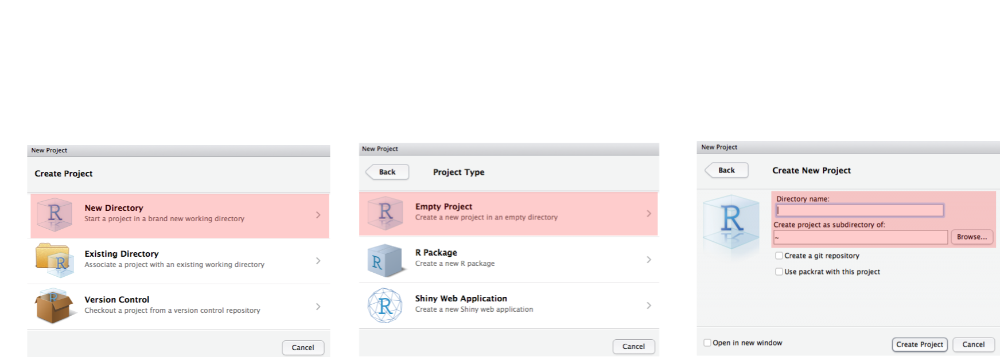

... document compilation in progress (`r lubridate::now()`)

```{r setup, include=FALSE}
knitr::opts_chunk$set(echo = FALSE)
```

## Typical science project  {.smaller}

* Import
    * Import data stored in a file, database, or web API, and load it into a data frame in R
* Tidy
    * Each column is a variable, and each row is an observation
* Transform
    * Narrowing in on observations of interest
    * Creating new variables that are functions of existing variables
    * Calculating a set of summary statistics (like counts or means)
    * ...
* Visualise
    * May show unexpected things
    * May raise new questions about the data
    * A powerful communication platform
* Model
    * Once questions made sufficiently precise, one can use a model to answer them
    * Model cannot question its own assumptions!
* Communicate
    * Presentation and documentation

## Typical science project

```{r fig.width = 10, echo=FALSE}
library(png)
library(grid)
img <- readPNG("diagrams/r4ds/data-science.png")
grid.raster(img)
```

## Why R?

R has become the lingua franca of statistical analysis and data wrangling

* Its free! If you are a teacher or a student, the benefits are obvious
* It runs on a variety of platforms including Windows, Unix and MacOS
* It provides an unparalleled platform for programming new statistical
methods in an easy and straightforward manner
* It offers powerful tools for data exploration and presentation

## What is R?

* R is command line driven:
    * its biggest appeal as one can reuse commands
    * its biggest hurdle in widespread use
* R is open-source:
    * Other statistical software packages can be extremely expensive
    * Large user base with almost all statistical methods implemented

## RStudio + R: A science project environment  {.smaller}

```{r fig.width = 10, echo=FALSE}
library(png)
library(grid)
img <- readPNG("img/rstudio.png")
grid.raster(img)
```

* **Console**: One can type R commands directly into the console to perform calculations
* **Script editor**: An R script is basically a series of stored R commands that can be run in the
console
    * To generate a new script do: New file -> R Script (ctrl-shif-N)
* **Environment**: Contains a list of all declared variables. If you have a dataset you can double click the variable to view the data.
* **History** Contains a list of previous commands entered into the console
* **Other items**:
    * Files: List of object in a directory
    * Plots: Graphical output from R. The user can export these the figures to file (as jpeg, png or pdf) or to clipboard
    * Help: Gives a browsable interface to R’s in-line help pages. The user can search for a topic or a specific function
    
## RStudio

* RStudio allows the user to run R in a user-friendly IDE environment.
* It is open-source (i.e. free) and available at www.rstudio.com
* Built to help you write R code, run R code, and analyze data with R
* Text editor, version control, project handling, markdown support, keyboard shortcuts, debugging tools, ...

* Within RStudio one can achieve almost all that is needed to complete a typical science project

## RStudio project

* RStudio allows us to make things a little bit easier by isolating the various tasks within specific projects
* Projects save the state between sessions. This includes:
    * Working directories
    * Open files/scripts
    * Workspaces
    * Color scheme
* One can have multiple RStudio projects open at any one time
    * The modern call for multitasking :-)
    
## Creating an RStudio project {.smaller}

Projects are created by selecting File -> New project



## Hand-on-exercise

* Open R-studio and create a new project: File -> New project
* Create a new R script: File -> New file -> R Script
* Copy the content of [this](http://www.hafro.is/~einarhj/education/ofcouRse2016/R/Exercise1.R) into the R script.
* Save the script, e.g. Excercise1.R
* We will run each line of code, observe, change, add, and most importantly learn while doing
* Once you have gone through the whole script, try: File -> Compile Report ..., choosing the output according to your liking :-)

## Todays element - visualise

```{r fig.width = 10, echo=FALSE}
library(png)
library(grid)
img <- readPNG("diagrams/r4ds/data-science-explore.png")
grid.raster(img)
```

We will basically learn to visualize data with the `ggplot2`-package

But before we start, we may need to install that package

## R packages

...

## Installing packages

We may as well try to install/update most of the package we may use in the course now. Lets try to run the following (I would be surprised if this works for everybody):

```{r cran-installation, eval = FALSE, echo = TRUE}
install.packages("tidyverse")
```

This will install the __core__ tidyverse packages:

* ggplot2, for data visualisation.
* dplyr, for data manipulation.
* tidyr, for data tidying.
* readr, for data import.
* purrr, for functional programming.
* tibble, for tibbles, a modern re-imagining of data frames.

It also installs a selection of other tidyverse packages that you're likely to use frequently, but probably not in every analysis. This includes packages for:

*   Working with specific types of vectors:

    * hms, for times.
    * stringr, for strings.
    * lubridate, for date/times.
    * forcats, for factors.

*   Importing other types of data:

    * DBI, for databases (..., this may create a problem)
    * haven, for SPSS, SAS and Stata files.
    * httr, for web apis.
    * [jsonlite](https://github.com/jeroenooms/jsonlite) for JSON.
    * readxl, for `.xls` and `.xlsx` files.
    * rvest, for web scraping.
    * xml2, for XML.

*   Modelling

    * modelr, for modelling within a pipeline
    * [broom](https://github.com/dgrtwo/broom), for turning models into 
      tidy data

These packages will be installed along with tidyverse, but you'll load them explicitly with `library()`.

`library(tidyverse)` will load the core tidyverse packages.

## Remedy (if above does not work):

Let's at minimum try:
```{r, eval = FALSE, echo = TRUE}
install.packages("ggplot2")         # for data visualisation.
install.packages("dplyr")           # for data manipulation.
install.packages("tidyr")           # for data tidying.
install.packages("readr")           # for data import.
install.packages("purrr")           # for functional programming.
install.packages("tibble")          # for tibbles, a modern re-imagining of data frames.
install.packages("lubridate")       # for working with dates
```

## And then some ...

```{r, eval = FALSE, echo = TRUE}
install.packages("geo")          # The old MRI faithful for geoplots
install.packages("ggmap")        # Fancy gis map backgrounds
install.packages("viridis")      # Nicer colour schemes than as ggplot2
```

You can expect that there will be some additional packages to install as we progress.
